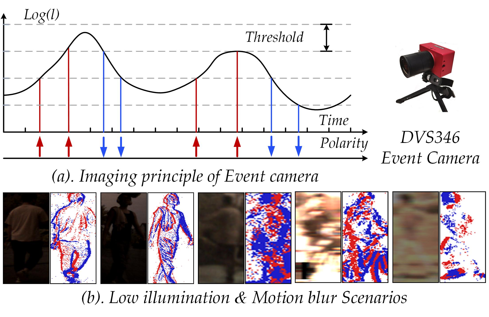
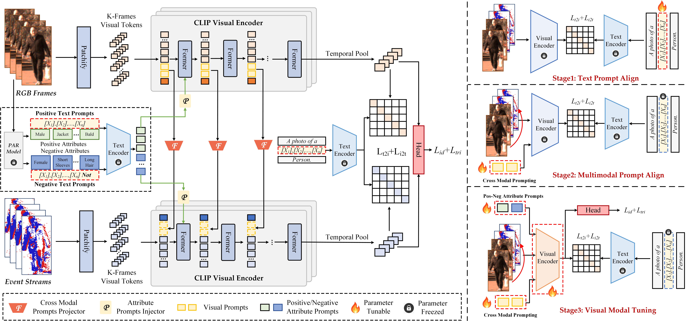

## 

**When Person Re-Identification Meets Event Camera: A Benchmark Dataset and An Attribute-guided Re-Identification Framework**, 
  Xiao Wang, Qian Zhu, Shujuan Wu, Bo Jiang, Shiliang Zhang, Yaowei Wang, Yonghong Tian, Bin Luo*
  arXiv Pre-print [[Paper](https://github.com/Event-AHU/Neuromorphic_ReID/blob/main/TriPro-main/paper.pdf)] 


### Abstract 
Recent researchers have proposed using event cameras for person re-identification (ReID) due to their promising performance and better balance in terms of privacy protection, event camera-based person ReID has attracted significant attention. Currently, mainstream event-based person ReID algorithms primarily focus on fusing visible light and event stream, as well as preserving privacy. Although significant progress has been made, these methods are typically trained and evaluated on small-scale or simulated event camera datasets, making it difficult to assess their real identification performance and generalization ability. To address the issue of data scarcity, this paper introduces a large-scale RGB-Event based person ReID dataset, called EvReID. The dataset contains 118,988 image pairs and covers 1200 pedestrian identities, with data collected across multiple seasons, scenes, and lighting conditions. We also evaluate 15 state-of-the-art person ReID algorithms, laying a solid foundation for future research in terms of both data and benchmarking. Based on our newly constructed dataset, this paper further proposes a pedestrian attribute-guided contrastive learning framework to enhance feature learning for person re-identification, termed TriPro-ReID. This framework not only effectively explores the visual features from both RGB frames and event streams, but also fully utilizes pedestrian attributes as mid-level semantic features. Extensive experiments on the EvReID dataset and MARS datasets fully validated the effectiveness of our proposed RGB-Event person ReID framework. 
<p align="center">
  
</p>
<p align="center">
  
</p>


### **Requirements**
```
We use a single RTX3090 24G GPU for training and evaluation.
```

### **Basic Environment**
```
conda env create -f environment.yml
conda activate your_env_name ##### which you need to change in the environment.yml
```

### **Benchmark Dataset**


* **EvReID dataset (1.83 GB)** is released on [**BaiDuYun**](https://pan.baidu.com/s/1fD7j-EzvtohY8jt90QNq6g?pwd=zzzz).
* **MARS (43.73 GB)** (which contains two modalities) is released on [**BaiDuYun**](https://pan.baidu.com/s/1b2mKktkaqoDFpm1_-4KeIg?pwd=zzzz)


We also provide **DropBox** to download these datasets:

* **EvReID dataset (1.83 GB)** is released on [[**DropBox**](https://www.dropbox.com/scl/fi/786c3wtixdms8yg24tyyf/EvReID.zip?rlkey=xvs02ygaeu73k446slbuura2t&st=i28si6vl&dl=0)]
* **MARS (43.73 GB)** (which contains two modalities) is released on [[**DropBox**](https://www.dropbox.com/scl/fi/tn6uie57fw72y7wqvgh0x/mars.zip?rlkey=ajm5038fhd57d4cngb4qoqmu3&st=q0ply2rc&dl=0)]


###  :car: Run TriPro-ReID
For example, if you want to run this method on MARS, you need to modify the bottom of configs/vit_mars_clipreid.yml to
```
DATASETS:
   NAMES: ('MARS')
   ROOT_DIR: ('your_dataset_dir')
OUTPUT_DIR: 'your_output_dir'
```
And you need to organize your dataset as:
```
MARS:
  --- RGB
    --- train
    --- test
  --- event
    --- train
    --- test
  --- info
  --- attr
    --- train.json
    --- test.json
 ```
 
Then, run
```
CUDA_VISIBLE_DEVICES=0 python train_mars.py
```
Or you can directly run the following command, which is more convenient
```
sh mars.sh
```

###  :car: Evaluation
For example, if you want to test methods on MARS, run
```
CUDA_VISIBLE_DEVICES=0 python test.py
```


### Acknowledgement 

* [CLIP-reID]
* [TF-CLIP]
* [MARS-dataset]
* [VTFPAR++] 


### Citation 
If you find this works helps your research, please give us a **star** and cite the following works: 

```
@misc{wang2025personreidentificationmeetsevent,
      title={When Person Re-Identification Meets Event Camera: A Benchmark Dataset and An Attribute-guided Re-Identification Framework}, 
      author={Xiao Wang and Qian Zhu and Shujuan Wu and Bo Jiang and Shiliang Zhang and Yaowei Wang and Yonghong Tian and Bin Luo},
      year={2025},
      eprint={2507.13659},
      archivePrefix={arXiv},
      primaryClass={cs.CV},
      url={https://arxiv.org/abs/2507.13659}, 
}
```
